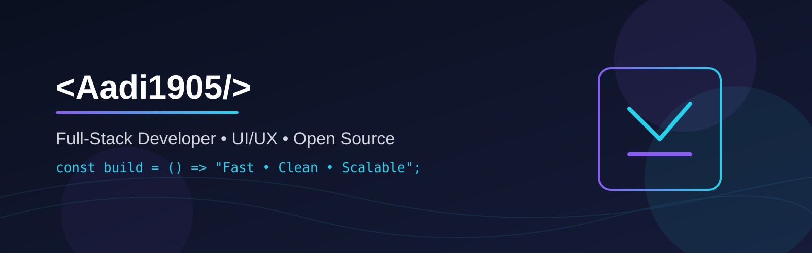

  

  
  

# 👋 Hi, I'm Aditya Mamgain

## 💻 Who Am I

- 👨‍💻 Full-Stack Developer
- 📍 Dehradun, Uttarakhand
- 🚀 Currently building Mountain Mate
- ☕ I turn coffee into clean interfaces

I build thoughtful web experiences that are fast, accessible, and a little bit delightful.
When I'm not shipping code, you'll find me learning, experimenting, and building projects that solve real problems.

---

## 🚀 Tech I Enjoy Using

  

---

## 🌟 Featured Projects

<table>
<tr>

<td width="50%" valign="top">

### IPC-Benchmarking-Framework

IPC Benchmarking Framework A dependency-free web app that simulates common inter-process communication (IPC) mechanisms and reports average latency and throughput.

**Repository:**  
https://github.com/Aadi1905/IPC-Benchmarking-Framework

</td>

<td width="50%" valign="top">

### ⚡ Blockchain-based-E-VOTING-System

SecureVote Starter Flask application for a secure-voting prototype.

**Repository:**  
https://github.com/Aadi1905/Blockchain-based-E-VOTING-System

</td>

</tr>
</table>

---

## 📊 GitHub Telemetry

  

  

  

---

## 🌐 Connect With Me

  

  

  

---

<i>"Make it work, make it right, make it memorable."</i>

